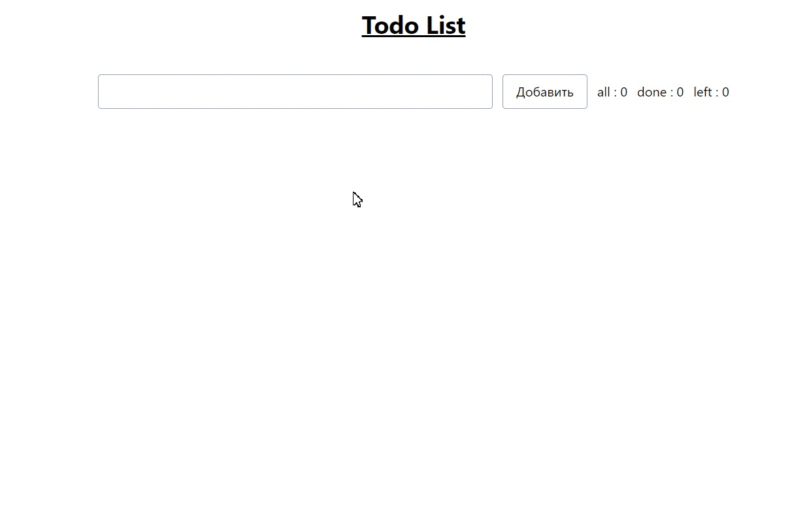

# Todo list React FC + Tailwind Css
### Features
- В случае если todo пустая (пробелы тоже считаются) не дает добавить todo
- В верху страницы отображается сколько todo всего, сколько из них выполнены, сколько осталось
- Если отметить todo как выполненную, она красится в серый цвет
- При нажатии "Удалить", todo удаляется
---
### TODO
 - При наведении мышкой на любую todo в любом месте, справа появляется кнопка, по нажатию на которую, можно удалить todo из списка
 - Mobile adaptive
 - Категории (!!!, !!, !, . )
 - Оптимизация под большое кол-во Todo
 - Анимации
 ---

